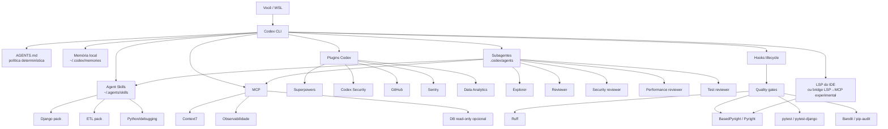

# Codex CLI profissional para Python/Django/ETL: Skills, Plugins, MCP, Hooks, Memória, Subagentes e LSP

## Resumo executivo

Em **12 de setembro de 2026**, o melhor caminho para extrair o máximo do harness do Codex CLI não é transformar `~/.agents/skills` em um depósito de centenas de Skills. A arquitetura mais forte é separar responsabilidades:

| Camada | Recomendação | Papel |
|---|---|---|
| Metodologia de engenharia | **Superpowers oficial no marketplace Codex** | TDD, debugging, planning, reviews, worktrees, subagentes, verificação |
| Segurança | **Codex Security** | revisão AppSec e diff scanning |
| Integração Git | **GitHub plugin** | PR, issue, CI e workflows GitHub |
| Observabilidade | **Sentry**, opcionalmente Datadog | exceções, produção, investigação |
| Dados/ETL | **Data Analytics plugin + Skills especializadas** | análise de dados, workflows analíticos |
| Documentação técnica | **Context7 MCP** | documentação atual de bibliotecas |
| Python/Django | Skills próprias + Hermes portadas | debugging, ORM, migrations, pytest, segurança |
| Qualidade determinística | Ruff + BasedPyright/Pyright + pytest + Bandit/pip-audit | fonte de verdade mecânica |
| Orquestração | Subagentes nativos do Codex | revisão paralela, exploração, investigação |
| Persistência | `AGENTS.md` + memória local Codex | política determinística + memória adaptativa |
| Automação | Hooks | gates antes/depois de tools, sessões e compactação |
| LSP | IDE LSP + quality gates; bridge MCP opcional | Codex ainda não documenta cliente LSP nativo |

A descoberta mais importante da pesquisa é que **o cenário mudou significativamente em 2026**: o antigo repositório `openai/skills` está explicitamente marcado como **deprecated** e manda usar o novo **`openai/plugins`**. O formato de plugin atual pode empacotar simultaneamente `skills/`, MCP, `agents/`, `commands/`, `hooks.json`, assets e outras superfícies. fileciteturn3file0L2-L2 fileciteturn5file0L2-L2

Também há uma mudança particularmente relevante para sua comparação Hermes × Codex: **Superpowers agora está no marketplace oficial do Codex**, com `systematic-debugging`, TDD, code review, planejamento, execução, worktrees e desenvolvimento orientado por subagentes. Ou seja, grande parte da sensação de “harness vazio” que você teve no Codex pode hoje ser resolvida com um único plugin oficial. fileciteturn7file0L2-L2 fileciteturn8file0L2-L10

Minha recomendação concreta para seu WSL/Python/Django/ETL é:

> **Codex CLI + Superpowers + Codex Security + GitHub + Context7 + Sentry + Skills próprias Django/ETL + memória local + hooks de quality gate + subagentes especializados.**

Eu **não** instalaria novamente via `skills.sh` as Skills que já vierem pelo Superpowers oficial: duplicar uma Skill entre plugin, `~/.agents/skills` e caminhos antigos como `~/.codex/skills` é uma fonte real de conflito e já há issues no ecossistema `skills` sobre duplicatas, symlinks e remoção incompleta. ## Arquitetura recomendada e estado do Codex

### O harness atual

O Codex atual tem quatro extensões que vale distinguir conceitualmente:

**Skill** é conhecimento/procedimento reutilizável. Uma Skill é um diretório que contém pelo menos `SKILL.md`; pode também conter scripts, referências, assets e agentes. O Codex pode ativá-la explicitamente ou inferir sua utilização pela descrição. Skills pessoais ficam em `$HOME/.agents/skills`, Skills do projeto em `.agents/skills`, e a configuração pode desabilitar Skills específicas. **Plugin** é hoje o mecanismo superior para empacotar/distribuir uma solução completa. Além de Skills, um plugin pode trazer MCP, hooks, agentes, commands e configuração associada. O próprio repositório oficial `openai/plugins` usa uma árvore `plugins/<nome>/` com `.codex-plugin/plugin.json`. fileciteturn5file0L2-L2

**MCP** traz ferramentas e fontes externas em runtime. O Codex suporta servidores STDIO e Streamable HTTP, autenticação e controle de ferramentas individualmente. CLI, IDE e Desktop locais compartilham a configuração MCP do host. **Hooks** interceptam o ciclo de vida. O Codex atual documenta eventos como `SessionStart`, `UserPromptSubmit`, `PreToolUse`, `PostToolUse`, `PreCompact`, `PostCompact`, `SubagentStart`, `SubagentStop`, `Stop`, `Interrupt` e `SessionEnd`; handlers podem ser comandos locais e, em diversos eventos, ferramentas MCP. A arquitetura profissional que eu usaria fica assim:



Essa composição é mais robusta que tentar resolver tudo com Skills: Skills definem **como pensar e agir**; tools/MCP dão capacidades; hooks impõem políticas; linters/testes fornecem evidência determinística; subagentes dão paralelismo; memória e `AGENTS.md` preservam contexto. Os subagentes atuais do Codex podem ser solicitados pelo usuário, por `AGENTS.md` ou por uma Skill e podem ter configuração própria, inclusive Skills e MCP disponíveis ao agente. ## Catálogo consolidado de Skills e Plugins

### Plugins e Skills que eu priorizaria

O repositório oficial atual da OpenAI contém, entre outros, `superpowers`, `codex-security`, `github`, `coderabbit`, `data-analytics`, `datadog`, `sentry`, `supabase`, `circleci`, `temporal` e `build-web-apps`. fileciteturn6file0L1-L11

| Recurso | Origem | Codex | Função principal | Instalação / acesso | Uso típico |
|---|---|---:|---|---|---|
| **Superpowers** | Marketplace oficial Codex / obra | **Sim, nativo** | workflow de engenharia completo | `codex` → `/plugins` → buscar `superpowers` | “implemente isto seguindo TDD e revisão” |
| systematic-debugging | Superpowers | **Sim** | root-cause debugging | incluída no plugin | bug intermitente, regressão |
| test-driven-development | Superpowers | **Sim** | RED → GREEN → REFACTOR | incluída | feature/bugfix |
| verification-before-completion | Superpowers | **Sim** | exigir evidência antes de declarar sucesso | incluída | final de qualquer tarefa |
| requesting-code-review | Superpowers | **Sim** | revisão independente | incluída | antes de merge |
| receiving-code-review | Superpowers | **Sim** | processar feedback tecnicamente | incluída | correção pós-review |
| writing-plans | Superpowers | **Sim** | decomposição executável | incluída | feature grande |
| executing-plans | Superpowers | **Sim** | execução em estágios | incluída | plano aprovado |
| subagent-driven-development | Superpowers | **Sim** | agentes por tarefa + reviews | incluída | implementação grande |
| dispatching-parallel-agents | Superpowers | **Sim** | investigações paralelas | incluída | bugs independentes |
| using-git-worktrees | Superpowers | **Sim** | isolamento de branches | incluída | agentes paralelos |
| finishing-a-development-branch | Superpowers | **Sim** | testes + merge/PR/cleanup | incluída | final da branch |
| brainstorming | Superpowers | **Sim** | design antes de codar | incluída | requisitos vagos |
| **Codex Security** | OpenAI | **Sim, nativo** | AppSec e diff scan | `codex plugin add codex-security@openai-curated` | `$codex-security:security-diff-scan` |
| **GitHub** | OpenAI marketplace | **Sim, nativo** | PR/issues/CI/repo | `/plugins` | investigar PR/CI |
| **Sentry** | OpenAI marketplace | **Sim, nativo** | erros/produção | `/plugins` | investigar exception real |
| **Data Analytics** | OpenAI marketplace | **Sim, nativo** | análise/dados/MCP | `/plugins` | investigação ETL/dados |
| **CodeRabbit** | OpenAI marketplace | **Sim, nativo** | revisão de código | `/plugins` | segunda opinião em PR |
| **CircleCI** | OpenAI marketplace | **Sim, nativo** | pipelines/CI | `/plugins` | debug de pipeline |
| **Supabase** | OpenAI marketplace | **Sim, nativo** | banco/backend Supabase | `/plugins` | SQL/schema/backend |
| **Temporal** | OpenAI marketplace | **Sim, nativo** | workflows duráveis | `/plugins` | ETLs/workflows long-running |

O próprio Superpowers documenta instalação no Codex CLI por `/plugins` e afirma que está no marketplace oficial do Codex. Seu fluxo base passa por brainstorming, worktrees, planejamento, subagent-driven-development/execution, TDD, code review e finalização da branch. fileciteturn9file0L2-L10

O diretório oficial confirma que o plugin inclui `systematic-debugging`, `test-driven-development`, `verification-before-completion`, `requesting-code-review`, `receiving-code-review`, `subagent-driven-development`, `dispatching-parallel-agents`, `using-git-worktrees`, `writing-plans` e outras. fileciteturn8file0L2-L10

O `Data Analytics` é um bom exemplo de quão mais poderoso ficou o formato plugin: o pacote atual contém simultaneamente `.codex-plugin`, `.mcp.json`, `AGENTS.md`, `skills/`, implementação MCP, scripts e testes. fileciteturn11file0L2-L10

### Skills.sh que ainda agregam valor

`skills.sh` continua muito útil para preencher lacunas fora do marketplace. A CLI `vercel-labs/skills` suporta explicitamente Codex e permite selecionar agente, Skill, instalação global, cópia física e atualização. O padrão que eu usaria é:

```bash
npx --yes skills@latest find "django"
npx --yes skills@latest find "python debugging"
npx --yes skills@latest find "postgres performance"

npx --yes skills@latest add OWNER/REPO \
  --skill SKILL_NAME \
  --agent codex \
  --global \
  --copy \
  --yes
```

Eu prefiro **`--copy`** no seu pack de produção a depender de uma topologia complicada de symlinks. Isso também reduz a chance de cair nas inconsistências relatadas no próprio projeto em torno de instalações globais, symlinks e remoção de Skills. As Skills de terceiros mais interessantes encontradas para seu perfil foram:

| Skill | Repositório/origem | Compatibilidade | Valor para você |
|---|---|---:|---|
| `diagnosing-bugs` | mattpocock | Sim via skills.sh | diagnóstico disciplinado |
| `code-review` | mattpocock | Sim | review estruturado |
| `codebase-design` | mattpocock | Sim | arquitetura/codebase |
| `domain-modeling` | mattpocock | Sim | excelente para domínio Django |
| `setup-pre-commit` | mattpocock | Sim | automatizar quality gates |
| `request-refactor-plan` | mattpocock | Sim | refatoração planejada |
| `qa` | mattpocock | Sim | QA pós-implementação |
| `supabase-postgres-best-practices` | Supabase | Sim | PostgreSQL/performance |
| `playwright-cli` | Microsoft | Sim | browser/E2E |
| `webapp-testing` | Anthropic | Sim via padrão Agent Skills | QA web |
| `find-skills` | Vercel Labs | Sim | discovery de novas Skills |

Essas entradas aparecem no ecossistema/índice atual do Skills.sh e a CLI oficial do projeto permite instalar Skills em Codex. Exemplos:

```bash
npx --yes skills@latest add mattpocock/skills \
  --skill diagnosing-bugs \
  --agent codex -g --copy -y
```

```bash
npx --yes skills@latest add mattpocock/skills \
  --skill domain-modeling \
  --agent codex -g --copy -y
```

```bash
npx --yes skills@latest add supabase/agent-skills \
  --skill supabase-postgres-best-practices \
  --agent codex -g --copy -y
```

Como o registry pode ficar atrás do GitHub de origem, para um ambiente profissional eu trataria o **repositório Git upstream e um commit/tag fixado como fonte de verdade**, em vez de confiar cegamente no índice. Issues do próprio projeto mostram casos em que o conteúdo/indexação ficou defasado. ### O que portar do Hermes

O catálogo atual do Hermes inclui `codebase-inspection`, `python-debugpy`, `requesting-code-review`, `simplify-code`, `spike`, `systematic-debugging`, `test-driven-development`, `dogfood` e outras Skills de desenvolvimento. A compatibilidade precisa ser entendida em dois níveis:

**compatibilidade do formato**: `SKILL.md` e instruções são fáceis de transportar;

**compatibilidade do runtime**: uma Skill que chama uma primitive Hermes como `delegate_task`, ou pressupõe tools específicas do browser/debugger do Hermes, não é diretamente executável no Codex.

| Skill Hermes | Portabilidade | Por quê | Adaptação para Codex |
|---|---:|---|---|
| `systematic-debugging` | **Direta** | essencialmente metodologia | copiar/revisar `SKILL.md` |
| `test-driven-development` | **Direta** | workflow conceitual | preferir versão Superpowers oficial |
| `spike` | **Direta** | metodologia de experimentação | praticamente nenhuma |
| `codebase-inspection` | **Quase direta** | usa ferramentas externas como `pygount` | instalar dependência e ajustar paths |
| `python-debugpy` | **Quase direta** | baseia-se em Python/pdb/debugpy | remover referências Hermes |
| `github` | **Parcial** | tools/runtime próprios | substituir por GitHub plugin/`gh` |
| `requesting-code-review` | **Parcial** | delegação independente | mapear para custom subagent reviewer |
| `simplify-code` | **Parcial** | revisão paralela/delegação | mapear `delegate_task` → subagentes Codex |
| `dogfood` | **Parcial** | depende de browser/tooling | Playwright/browser workflow |
| `sdlc-review` | **Parcial** | orquestração de revisores | subagentes especializados |
| Hermes skill-authoring | **Não vale portar** | voltada ao runtime Hermes | usar Skill Creator/Codex |
| Desktop-DOM Hermes | **Não** | específica do produto | sem equivalente necessário |

`systematic-debugging` e TDD não dependem fundamentalmente do runtime Hermes e portanto são conceitualmente portáveis; `python-debugpy` também se apoia em ferramentas Python reais, embora exija limpeza das referências de harness. O ponto crítico é `delegate_task`. Hermes possui essa primitive própria de delegação/subagentes. No Codex, a tradução correta **não é trocar o nome de uma função**; é reescrever a Skill para solicitar agentes/subagentes nativos do Codex, eventualmente com agentes definidos em `.codex/agents/*.toml`. Por exemplo, uma Skill Hermes conceitualmente assim:

```text
delegate_task(security_reviewer)
delegate_task(test_reviewer)
delegate_task(performance_reviewer)
delegate_task(code_quality_reviewer)
aggregate()
```

deve ser portada semanticamente como:

```markdown
## Parallel review

For a non-trivial change, delegate independent reviews to subagents:

- security reviewer
- test reviewer
- performance reviewer
- code-quality reviewer

Run independent reviews concurrently when possible.
Wait for all reviewers.
Deduplicate findings.
Resolve disagreements using repository evidence.
Do not modify code until the review stage is complete.
```

Isso explora o mecanismo **nativo de subagentes do Codex**, em vez de fingir que a API Hermes existe. ## Pack prioritário para Python, Django e ETL

Esta é a ordem em que eu montaria seu ambiente. “Instalar” nesta tabela às vezes significa instalar o plugin que contém a Skill; não recomendo instalar a mesma Skill novamente por outro registry.

| Prioridade | Componente | Origem | Por que entra |
|---:|---|---|---|
| 1 | **Superpowers** | Plugin oficial | transforma o comportamento geral do agente |
| 2 | `systematic-debugging` | dentro Superpowers | evita debugging por tentativa-e-erro |
| 3 | `verification-before-completion` | Superpowers | reduz “está pronto” falso |
| 4 | `test-driven-development` | Superpowers | disciplina de implementação |
| 5 | `writing-plans` | Superpowers | trabalho complexo e ETL |
| 6 | `subagent-driven-development` | Superpowers | usa efetivamente o harness multiagente |
| 7 | `requesting-code-review` | Superpowers | segundo olhar antes do merge |
| 8 | `dispatching-parallel-agents` | Superpowers | segurança/perf/testes em paralelo |
| 9 | **Codex Security** | OpenAI | revisão AppSec |
| 10 | **GitHub plugin** | OpenAI | PR/CI/issues |
| 11 | `diagnosing-bugs` | mattpocock/skills | abordagem complementar de bugs |
| 12 | `domain-modeling` | mattpocock/skills | muito útil em models/services Django |
| 13 | `codebase-design` | mattpocock/skills | refactors e arquitetura |
| 14 | `setup-pre-commit` | mattpocock/skills | torna gates persistentes |
| 15 | `supabase-postgres-best-practices` | Supabase | PostgreSQL/queries/indexes |
| 16 | `playwright-cli` | Microsoft | testes Django end-to-end |
| 17 | **python-debugpy port** | Hermes → local | debugging profundo Python |
| 18 | **django-orm-performance** | Skill própria | N+1, indexes, query plans |
| 19 | **django-security-review** | Skill própria | auth, permissions, CSRF, ORM/raw SQL |
| 20 | **etl-data-integrity** | Skill própria | idempotência, schema drift, reconciliation |

As posições 2–8 vêm como parte do Superpowers; o diretório atual do plugin oficial confirma essas Skills, portanto **não as instale também pelo Skills.sh**. fileciteturn8file0L2-L10

### Instalação inicial

No Codex:

```text
/plugins
```

Instale primeiro:

```text
Superpowers
Codex Security
GitHub
Sentry          # se você usa Sentry
Data Analytics  # especialmente útil para ETL/análise
```

O Superpowers documenta exatamente o fluxo `/plugins` → pesquisar `superpowers` → `Install Plugin` no Codex CLI. fileciteturn9file0L2-L10

Codex Security também tem instalação CLI documentada:

```bash
codex plugin add codex-security@openai-curated
```

e pode ser chamado em workflows como:

```text
$codex-security:security-diff-scan
```

A documentação atual da OpenAI apresenta esse plugin como a integração AppSec do Codex. Depois adicione somente as Skills que realmente preenchem lacunas:

```bash
npx --yes skills@latest add mattpocock/skills \
  --skill diagnosing-bugs \
  --agent codex -g --copy -y

npx --yes skills@latest add mattpocock/skills \
  --skill domain-modeling \
  --agent codex -g --copy -y

npx --yes skills@latest add mattpocock/skills \
  --skill codebase-design \
  --agent codex -g --copy -y

npx --yes skills@latest add mattpocock/skills \
  --skill setup-pre-commit \
  --agent codex -g --copy -y

npx --yes skills@latest add supabase/agent-skills \
  --skill supabase-postgres-best-practices \
  --agent codex -g --copy -y
```

A CLI `skills` documenta seleção por agente e Skill, instalação global e modo de cópia; o suporte a Codex está explicitamente listado. ## Harness avançado: memória, MCP, hooks, LSP e subagentes

### Memória: o que o Codex realmente possui

O Codex agora possui uma **memória local persistente**, mas é importante não projetar a taxonomia do Hermes sobre ela.

A documentação da OpenAI não descreve APIs formais chamadas “short-term memory API” e “long-term memory API”. O que existe é aproximadamente:

| Necessidade | Mecanismo Codex |
|---|---|
| contexto imediato | contexto da conversa/thread |
| sobreviver à compactação | compaction + hooks `PreCompact`/`PostCompact` |
| regras permanentes | `AGENTS.md` |
| aprendizagem entre sessões | memória local Codex |
| conhecimento de projeto | arquivos/versionamento + Skills |
| armazenamento externo estruturado | MCP/plugin externo |

A memória local do Codex é separada da memória do ChatGPT web, é armazenada em `~/.codex/memories/`, pode conter resumos, entradas duráveis, inputs recentes e evidências auxiliares e é gerada/adaptada durante períodos ociosos. Ela fica **desligada por padrão**. Ativação:

```toml
# ~/.codex/config.toml

[features]
memories = true
```

A configuração atual expõe controles como geração/uso das memórias, modelos de extração e consolidação, idade máxima de rollouts e thresholds relacionados a rate limit. Uma configuração conservadora seria:

```toml
[features]
memories = true

[memories]
generate_memories = true
use_memories = true
max_rollout_age_days = 30
max_unused_days = 30
min_rollout_idle_hours = 6
min_rate_limit_remaining_percent = 25
```

Os valores acima correspondem às opções documentadas; quando uma versão específica não estiver declarada no seu binário, trate-a como **não especificada** e confirme via configuração/help da versão instalada antes de automatizar rollout corporativo. Há também:

```text
/memories
```

para gerenciamento no cliente local. A documentação não apresenta uma CRUD API estável para manipular diretamente cada memória como se fosse um banco de fatos. Para informações **determinísticas**, prefira `AGENTS.md`:

```markdown
# ~/.codex/AGENTS.md

## Python
- Use Python 3.13+ when supported by the project.
- Prefer uv for environment/package operations when the repository uses it.
- Run Ruff before declaring a change complete.
- Run type checking on changed Python modules.

## Django
- Inspect migrations before applying them.
- Do not introduce N+1 queries.
- Prefer select_related/prefetch_related where evidence warrants it.
- Run django system checks after relevant changes.

## ETL
- Preserve idempotency.
- Validate row counts before and after transformations.
- Never assume source schemas are stable.
- Report rejected/invalid rows explicitly.

## Verification
Never claim completion without fresh test/lint/type-check evidence.
```

O Codex lê instruções `AGENTS.md` globalmente e também hierarquicamente dentro do projeto; instruções mais próximas do arquivo de trabalho podem especializar as superiores. Minha regra seria:

> **AGENTS.md = constituição; Skills = procedimentos; memória = experiências aprendidas.**

### MCP: menos servidores, melhores servidores

O Codex suporta **STDIO** para servidores locais e **Streamable HTTP** para servidores remotos; pode controlar servidor, autenticação, tools habilitadas/desabilitadas e políticas de aprovação. O MCP que eu instalaria imediatamente é **Context7**, inclusive usado pela própria documentação Codex como exemplo:

```bash
codex mcp add context7 -- npx -y @upstash/context7-mcp
```

Depois:

```bash
codex mcp list
codex mcp --help
```

A própria documentação oficial mostra esse comando e o mecanismo de `codex mcp add`. Para HTTP/OAuth:

```bash
codex mcp login <server-name>
```

também é um fluxo documentado. A configuração equivalente fica conceitualmente assim:

```toml
[mcp_servers.context7]
command = "npx"
args = ["-y", "@upstash/context7-mcp"]
```

Eu evitaria adicionar um MCP genérico com acesso irrestrito ao PostgreSQL de produção. Para ETL/Django, prefira:

```text
Codex
   │
   ├── DB dev/test: acesso normal
   │
   └── DB produção: MCP/credencial READ ONLY
                           │
                           ├── SELECT
                           ├── EXPLAIN
                           └── metadados/schema
```

Escritas de produção devem continuar fora do caminho autônomo padrão.

“**MCP multi-channel/pipeline**” não é uma primitive documentada do Codex. O que podemos montar é uma composição:

```text
Skill
  ↓
Subagents
  ├─→ Context7 MCP
  ├─→ GitHub plugin
  ├─→ Sentry plugin
  └─→ DB read-only
  ↓
Hooks
  ↓
quality gates
```

Ou seja, existe um pipeline arquitetural, mas **não trataria “MCP pipeline” como uma API nativa**. ### Hooks: onde o harness fica realmente forte

O Codex atual pode rodar hooks em eventos de sessão, tool use, compactação e subagentes. Pode chamar processos locais ou determinadas tools MCP. Para seu ambiente:

```toml
# ~/.codex/config.toml

[features]
hooks = true

[[hooks.SessionStart]]
matcher = "^compact$"

[[hooks.SessionStart.hooks]]
type = "command"
command = '/usr/bin/python3 "$HOME/.codex/hooks/session_start.py"'
additionalContextLimit = 5000


[[hooks.PreToolUse]]
matcher = "^Bash$"

[[hooks.PreToolUse.hooks]]
type = "command"
command = '/usr/bin/python3 "$HOME/.codex/hooks/pre_bash_policy.py"'
timeout = 30
statusMessage = "Validando comando"


[[hooks.PostToolUse]]
matcher = "^Bash$"

[[hooks.PostToolUse.hooks]]
type = "command"
command = '/usr/bin/python3 "$HOME/.codex/hooks/post_bash_review.py"'
timeout = 30
statusMessage = "Analisando resultado"
```

Essa estrutura é compatível com os exemplos documentados de `SessionStart`, `PreToolUse` e `PostToolUse`. Eu usaria hooks em três níveis:

```text
PreToolUse
    ↓
bloquear/alertar:
rm -rf
git reset --hard
DROP/TRUNCATE
migrate em produção
shell fora do workspace

PostToolUse
    ↓
coletar:
arquivos alterados
falhas
warnings
test output

Stop
    ↓
quality gate:
ruff
type checker
pytest focalizado
security check
git diff --check
```

Hooks também podem usar uma tool MCP como handler, mas precisam de uma conexão MCP existente; a documentação aponta ainda algumas restrições de lifecycle e disponibilidade. Outro detalhe de segurança importante: **hooks trazidos por plugins não são automaticamente confiáveis**; devem ser revisados/confiados. Isso é desejável: um plugin de terceiros não deveria ganhar execução local silenciosamente. ### LSP: a lacuna que ainda permanece

Aqui é onde eu **não venderia uma capacidade que o Codex ainda não possui**.

Até a pesquisa desta data, a documentação/configuração oficial não apresenta um cliente LSP first-class equivalente ao de editores como VS Code/Pyright. Issues no próprio repositório `openai/codex` continuam solicitando “LSP integration” e descrevem como workaround usar a indexação/LSP do IDE ou expor LSP ao agente através de MCP. Portanto, para Python eu usaria:

```text
                        ┌───────────────┐
                        │ basedpyright  │
VS Code / editor ──────►│     LSP       │
                        └───────┬───────┘
                                │
                           humano/IDE
                                │
Codex ──────────────────────────┼────────────
  │                             │
  ├── basedpyright CLI          │
  ├── ruff check                │
  ├── ruff format --check       │
  ├── pytest                    │
  └── optional LSP→MCP bridge ──┘
```

Isso não é tão elegante quanto um cliente LSP nativo, mas é mais confiável do que depender de um bridge comunitário como fundamento do harness.

No `AGENTS.md`:

```markdown
Before finalizing Python changes:

1. Run Ruff against changed Python code.
2. Run the configured type checker.
3. Run the smallest relevant pytest scope.
4. Expand to the full relevant test suite if the focused test passes.
5. Inspect git diff.
6. Do not claim success while diagnostics remain unexplained.
```

Assim o Codex recebe os mesmos diagnósticos que um LSP obteria para grande parte dos erros estáticos, mas por interfaces determinísticas de CLI.

Um bridge **LSP→MCP** pode ser adicionado experimentalmente, porém eu não o colocaria no baseline profissional até existir uma implementação suficientemente estável e auditada. Versão específica: **não especificada**.

### Subagentes: substituto correto para `delegate_task`

Os subagentes do Codex estão atualmente habilitados nas releases correspondentes à documentação pesquisada e podem ser configurados por projeto. Exemplo:

```toml
# .codex/config.toml

[agents]
max_concurrent_threads_per_session = 6
```

Eu criaria:

```text
.codex/
└── agents/
    ├── explorer.toml
    ├── python-reviewer.toml
    ├── django-reviewer.toml
    ├── test-reviewer.toml
    ├── security-reviewer.toml
    └── performance-reviewer.toml
```

E adotaria a regra:

```text
Mudança simples
    └─ Codex principal

Mudança média
    ├─ principal implementa
    └─ reviewer independente verifica

Mudança grande
    ├─ explorer
    ├─ implementation agents
    ├─ test reviewer
    ├─ security reviewer
    └─ performance reviewer
           ↓
       principal sintetiza
```

Isso é justamente onde Skills como `dispatching-parallel-agents` e `subagent-driven-development` passam a fazer diferença. O próprio Superpowers atual descreve desenvolvimento com um agente fresco por tarefa e revisão em dois estágios. fileciteturn9file0L2-L10

## Roteiro de montagem e automação

### Estrutura profissional

Eu não colocaria tudo literalmente sob `~/.agents/skills`; manteria o harness organizado:

```text
~/
├── .agents/
│   └── skills/
│       ├── diagnosing-bugs/
│       ├── domain-modeling/
│       ├── codebase-design/
│       ├── setup-pre-commit/
│       ├── postgres-best-practices/
│       │
│       ├── python-debugpy/
│       ├── python-quality/
│       │
│       ├── django-architecture/
│       ├── django-orm-performance/
│       ├── django-security-review/
│       ├── django-testing/
│       │
│       ├── etl-data-integrity/
│       ├── etl-debugging/
│       └── etl-performance/
│
├── .codex/
│   ├── AGENTS.md
│   ├── config.toml
│   ├── memories/
│   ├── hooks/
│   │   ├── session_start.py
│   │   ├── pre_bash_policy.py
│   │   └── post_bash_review.py
│   └── ...
│
└── projeto/
    ├── AGENTS.md
    ├── .agents/
    │   └── skills/
    │       └── business-domain/
    └── .codex/
        ├── config.toml
        └── agents/
            ├── explorer.toml
            ├── reviewer.toml
            ├── django-reviewer.toml
            ├── security-reviewer.toml
            └── performance-reviewer.toml
```

`$HOME/.agents/skills` é o local adequado para Skills suas/reutilizáveis; `.agents/skills` no repositório é mais apropriado para conhecimento específico daquele projeto/equipe. ### Bootstrap de Skills

Um bootstrap conservador:

```bash
#!/usr/bin/env bash
set -euo pipefail

SKILLS_HOME="${HOME}/.agents/skills"
CODEX_HOME="${HOME}/.codex"

mkdir -p \
  "${SKILLS_HOME}" \
  "${CODEX_HOME}/hooks"

command -v codex >/dev/null || {
  echo "ERRO: codex não encontrado no PATH" >&2
  exit 1
}

command -v npx >/dev/null || {
  echo "ERRO: npx não encontrado no PATH" >&2
  exit 1
}

install_skill() {
  local repo="$1"
  local skill="$2"

  echo "==> ${repo}:${skill}"

  npx --yes skills@latest add "${repo}" \
    --skill "${skill}" \
    --agent codex \
    --global \
    --copy \
    --yes
}

# Não reinstale aqui skills já fornecidas por Superpowers.

install_skill "mattpocock/skills" "diagnosing-bugs"
install_skill "mattpocock/skills" "domain-modeling"
install_skill "mattpocock/skills" "codebase-design"
install_skill "mattpocock/skills" "setup-pre-commit"

install_skill \
  "supabase/agent-skills" \
  "supabase-postgres-best-practices"

echo
echo "Skills externas concluídas."
echo "Instale plugins oficiais dentro do Codex com /plugins."
```

A sintaxe de `skills add`, `--agent`, `--skill`, `--global`, `--copy` e `--yes` é fornecida pela CLI atual do projeto. Para máxima reprodutibilidade, transforme depois esse bootstrap em um arquivo de lock interno seu:

```text
harness.lock
```

por exemplo:

```yaml
plugins:
  - superpowers
  - codex-security
  - github

skills:
  - repo: mattpocock/skills
    skill: diagnosing-bugs
    ref: "<commit-fixado>"

  - repo: mattpocock/skills
    skill: domain-modeling
    ref: "<commit-fixado>"

custom:
  - django-orm-performance
  - django-security-review
  - etl-data-integrity
```

O commit real deve ser preenchido a partir da revisão que você aprovar; não inventaria SHA sem fixá-lo explicitamente.

### Configuração Codex recomendada

Um ponto de partida:

```toml
# ~/.codex/config.toml

[features]
memories = true
hooks = true

[memories]
generate_memories = true
use_memories = true
max_rollout_age_days = 30
max_unused_days = 30
min_rollout_idle_hours = 6
min_rate_limit_remaining_percent = 25

[agents]
max_concurrent_threads_per_session = 6


# Context7
[mcp_servers.context7]
command = "npx"
args = ["-y", "@upstash/context7-mcp"]


# Hooks

[[hooks.PreToolUse]]
matcher = "^Bash$"

[[hooks.PreToolUse.hooks]]
type = "command"
command = '/usr/bin/python3 "$HOME/.codex/hooks/pre_bash_policy.py"'
timeout = 30
statusMessage = "Validando comando"


[[hooks.PostToolUse]]
matcher = "^Bash$"

[[hooks.PostToolUse.hooks]]
type = "command"
command = '/usr/bin/python3 "$HOME/.codex/hooks/post_bash_review.py"'
timeout = 30
statusMessage = "Revisando execução"
```

Os blocos de memória, MCP, subagentes e hooks correspondem às superfícies documentadas do Codex; algumas opções específicas podem evoluir entre releases, portanto versões não explicitamente identificadas pela documentação pesquisada devem ser tratadas como **não especificadas**. ### Skills locais que realmente faltam

Eu criaria uma `django-orm-performance` em vez de procurar eternamente uma Skill pública perfeita.

```text
~/.agents/skills/django-orm-performance/
├── SKILL.md
└── references/
    └── checklist.md
```

Exemplo de núcleo:

```markdown
---
name: django-orm-performance
description: Analyze and improve Django ORM/database performance using evidence.
---

# Django ORM Performance

Use this skill when investigating slow Django requests,
database-heavy jobs, ETL code, ORM regressions, or query count issues.

## Workflow

1. Reproduce the performance problem.
2. Identify the request/task/job and relevant queryset.
3. Measure query count and latency before changing code.
4. Search for:
   - N+1 queries
   - unnecessary `.all()`/materialization
   - missing `select_related`
   - missing `prefetch_related`
   - repeated aggregate queries
   - unnecessary model saves
   - missing or ineffective indexes
   - large transactions
   - pagination problems
5. Inspect generated SQL.
6. Use EXPLAIN/EXPLAIN ANALYZE only on an appropriate database.
7. Make the smallest evidence-backed change.
8. Add a regression test or query-count assertion where practical.
9. Re-measure.
10. Report before/after evidence.

Never claim a performance improvement solely from code appearance.
```

Para ETL:

```markdown
---
name: etl-data-integrity
description: Validate correctness, idempotency and reconciliation of ETL pipelines.
---

# ETL Data Integrity

For every ETL change:

1. Identify source contract and target contract.
2. Check null, type and range assumptions.
3. Detect schema drift.
4. Define duplicate/idempotency semantics.
5. Measure source row count.
6. Measure accepted/rejected rows.
7. Reconcile target row count or aggregate totals.
8. Test retry after partial failure.
9. Verify transaction/checkpoint semantics.
10. Never silently discard invalid records.
```

E para Django security:

```markdown
---
name: django-security-review
description: Perform security review of Django code and configuration.
---

# Django Security Review

Inspect:

- authentication and authorization boundaries
- object-level permissions
- CSRF assumptions
- unsafe redirects
- raw SQL
- unsafe template rendering
- upload validation
- session/cookie settings
- secret handling
- mass assignment / ModelForm exposure
- tenant isolation
- IDOR risks
- SSRF-capable outbound requests
- migrations that weaken constraints

Delegate an independent security reviewer for non-trivial changes.
Use Codex Security for a second pass.
```

Esse é exatamente o tipo de conhecimento em que uma Skill própria tende a superar uma Skill pública genérica: ela pode refletir sua arquitetura, suas regras de ETL e seu padrão Django.

## Riscos, incompatibilidades e fontes

### O que eu evitaria

| Risco | Impacto | Mitigação |
|---|---|---|
| instalar centenas de Skills | seleção pior, conflito de instruções | pack enxuto e curado |
| duplicar Superpowers pelo skills.sh | Skills repetidas | use o plugin oficial |
| usar antigo `openai/skills` como catálogo principal | conteúdo legado/deprecated | migrar para `openai/plugins` |
| Skill de terceiro com scripts sem auditoria | supply-chain/RCE | revisar, copiar, fixar commit |
| symlinks espalhados por vários homes | duplicatas difíceis de remover | um canonical home + `--copy` |
| MCP de banco com write em prod | alto impacto | read-only + allowlist |
| memória para regras críticas | comportamento não determinístico | `AGENTS.md` versionado |
| depender só da IA para lint/type | falsos negativos | Ruff/type checker/pytest |
| usar LSP bridge como requisito central | integração ainda não nativa | CLI diagnostics como baseline |
| subagentes demais | custo/contexto/latência | paralelizar só tarefas independentes |
| hook pesado em toda tool call | latência | gates baratos durante, suite maior no Stop/PR |

O repositório antigo de Skills estar deprecated é particularmente importante: o README oficial manda usar o repositório de Plugins e o guia atual de construção de plugins. fileciteturn3file0L2-L2

As instalações globais do `skills` também merecem disciplina. O próprio tracker contém relatos de uma Skill ser vista tanto em `~/.codex/skills` quanto em `~/.agents/skills`, remoções que deixam a cópia canônica para trás e updates que criam symlinks inesperados. ### Hermes usando provider Codex

Eu manteria Hermes + `openai-codex` como **laboratório/fallback**, não como camada obrigatória na frente do seu Codex principal.

Há issues recentes no repositório Hermes envolvendo especificamente o caminho Codex/Responses, OAuth e modelos atuais. Um exemplo de agosto de 2026 reporta replay incorreto de itens de reasoning ao usar GPT-5.6 via Responses, resultando em erro HTTP 400; outros reports de setembro discutem comportamento do provider `openai-codex`, credenciais e disponibilidade. Isso não significa que toda integração Hermes↔Codex esteja quebrada, mas mostra uma superfície adicional de compatibilidade que você elimina quando usa o Codex CLI nativamente. [Issue Hermes #97427](https://github.com/NousResearch/hermes-agent/issues/97427) [Issue Hermes #107307](https://github.com/NousResearch/hermes-agent/issues/107307)

Logo:

```text
PRODUÇÃO DE DESENVOLVIMENTO

Codex CLI nativo
     │
     ├── plugins oficiais
     ├── Skills
     ├── MCP
     ├── hooks
     ├── memory
     └── subagents


LAB / SEGUNDA OPINIÃO

Hermes
     │
     ├── harness próprio
     ├── skills próprias
     └── openai-codex provider
          ↑
      camada extra de compatibilidade
```

### Minha configuração final

Depois da pesquisa, meu baseline para seu perfil seria:

```text
Codex CLI
│
├── PLUGINS
│   ├── Superpowers                 ★★★★★
│   ├── Codex Security              ★★★★★
│   ├── GitHub                      ★★★★★
│   ├── Sentry                      ★★★★☆ quando usado
│   └── Data Analytics              ★★★★☆ ETL
│
├── SUPERPOWERS
│   ├── systematic-debugging
│   ├── test-driven-development
│   ├── verification-before-completion
│   ├── writing-plans
│   ├── executing-plans
│   ├── requesting-code-review
│   ├── receiving-code-review
│   ├── subagent-driven-development
│   ├── dispatching-parallel-agents
│   ├── using-git-worktrees
│   └── finishing-a-development-branch
│
├── SKILLS.SH EXTRAS
│   ├── diagnosing-bugs
│   ├── domain-modeling
│   ├── codebase-design
│   ├── setup-pre-commit
│   └── postgres-best-practices
│
├── CUSTOM / HERMES PORTS
│   ├── python-debugpy
│   ├── django-architecture
│   ├── django-orm-performance
│   ├── django-security-review
│   ├── django-testing
│   ├── etl-data-integrity
│   ├── etl-debugging
│   └── etl-performance
│
├── MCP
│   ├── Context7                    ★★★★★
│   ├── observabilidade             ★★★★☆
│   └── DB read-only                ★★★☆☆ conforme ambiente
│
├── SUBAGENTS
│   ├── explorer
│   ├── python-reviewer
│   ├── django-reviewer
│   ├── test-reviewer
│   ├── security-reviewer
│   └── performance-reviewer
│
├── HOOKS
│   ├── PreToolUse → safety
│   ├── PostToolUse → inspection
│   ├── Pre/PostCompact → continuity
│   └── Stop → verification
│
├── MEMORY
│   ├── AGENTS.md → regras determinísticas
│   └── ~/.codex/memories → aprendizado adaptativo
│
└── STATIC / TEST HARNESS
    ├── Ruff
    ├── BasedPyright/Pyright
    ├── pytest
    ├── pytest-django
    ├── coverage
    ├── Bandit
    └── pip-audit
```

O ponto principal é que **Superpowers oficial altera bastante a conclusão inicial sobre a distância Hermes × Codex**. Em agosto/setembro de 2026, o Codex já tem um pacote oficial de marketplace que entrega precisamente várias das práticas que tornavam Hermes atraente: debugging sistemático, TDD, planejamento, verificação, revisão, worktrees e desenvolvimento com subagentes. fileciteturn9file0L2-L10

Ainda restam duas lacunas que eu preencheria manualmente no seu caso: **Skills profundamente específicas de Django/ETL** e **semântica de código via LSP first-class**. Para a primeira, Skills próprias são a solução correta. Para a segunda, hoje eu continuaria usando BasedPyright/Pyright/Ruff/pytest como gates determinísticos e o LSP do IDE, deixando LSP→MCP como componente experimental; issues do projeto Codex ainda registram essa lacuna. ### Fontes primárias prioritárias

| Fonte | Uso |
|---|---|
| [OpenAI — Codex Skills](https://developers.openai.com/codex/skills) | modelo e descoberta de Skills |
| [OpenAI — Plugins](https://developers.openai.com/codex/plugins) | distribuição moderna |
| [OpenAI — Hooks](https://developers.openai.com/codex/hooks) | lifecycle/tool hooks |
| [OpenAI — MCP](https://developers.openai.com/codex/mcp) | configuração de servidores |
| [OpenAI Plugins GitHub](https://github.com/openai/plugins) | catálogo oficial atual |
| [OpenAI Skills GitHub](https://github.com/openai/skills) | legado; atualmente deprecated |
| [Superpowers](https://github.com/obra/superpowers) | metodologia/Skills |
| [Skills CLI](https://github.com/vercel-labs/skills) | instalação multi-harness |
| [Skills.sh](https://skills.sh/) | discovery/registry |
| [Hermes Agent](https://github.com/NousResearch/hermes-agent) | fonte das Skills Hermes |
| [Hermes Skills Catalog](https://hermes-agent.nousresearch.com/docs/reference/skills-catalog/) | catálogo bundled |
| [Codex GitHub](https://github.com/openai/codex) | issues/estado de LSP |

A hierarquia que eu adotaria para confiar em código/configuração é **docs OpenAI → `openai/plugins` → upstream GitHub da Skill/plugin → issues upstream → skills.sh como discovery**. O `openai/skills` antigo e cópias agregadas de terceiros ficam abaixo disso porque o próprio repositório oficial antigo informa que foi substituído pelo modelo de Plugins. fileciteturn3file0L2-L2