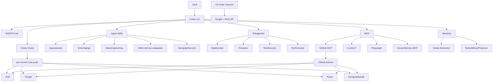

# Harness de desenvolvimento máximo para Codex CLI no WSL: Skills, MCP, Hooks, LSP e memória

## Resumo executivo

Para **WSL + Python/Django + ETL + GitHub CI**, eu não tentaria transformar o Codex em uma cópia do Hermes instalando centenas de Skills. A arquitetura mais forte hoje é **Codex nativo como runtime + um catálogo pequeno e curado de Agent Skills + MCPs de alto valor + Hooks determinísticos + LSP/linters fora do agente + memória em camadas**. Isso acompanha a própria recomendação atual da OpenAI: começar por `AGENTS.md`, enforcement determinístico como linters/pre-commit, depois Skills/Plugins, MCP e, por fim, subagentes. A descoberta mais importante é que o ecossistema amadureceu bastante:

**Skills são nativas de verdade no Codex.** O formato é um diretório com `SKILL.md` e, opcionalmente, `scripts/`, `references/`, `assets/` e configuração específica do agente. O Codex faz progressive disclosure, pode selecionar Skills implicitamente pela descrição ou explicitamente via `$skill-name`/`/skills`, e já inclui `$skill-creator`. **Plugins são, hoje, a unidade mais poderosa de extensão do Codex**, porque podem empacotar Skills + MCP + Hooks juntos. O Codex CLI possui browser `/plugins`, e o `$plugin-creator` existe justamente para transformar um workflow já estabilizado em um pacote reutilizável. **O antigo repositório `openai/skills` está oficialmente depreciado** e aponta usuários para a arquitetura atual de Plugins. O `$skill-installer` continua relevante para Skills individuais, mas novos bundles profissionais devem preferencialmente virar Plugins. **`skills.sh` é hoje a melhor camada de distribuição multi-harness.** O CLI oficial do projeto suporta Codex e permite escolher Skills individualmente, instalar globalmente ou por projeto, atualizar, remover e pesquisar. A sintaxe real é, por exemplo, `npx skills add owner/repo --skill foo -a codex -g -y`. **Hermes continua extremamente útil como fonte de Skills**, mas eu portaria as melhores Skills dele para Codex em vez de colocar Hermes permanentemente entre você e Codex. `provider: openai-codex` só é necessário quando **Hermes é o runtime** e chama o backend Codex; uma Skill Hermes copiada/adaptada para o Codex não precisa desse provider. O próprio Hermes documenta separadamente a autenticação `openai-codex` e o uso do Codex CLI standalone. **Codex agora também possui memória local nativa**, separada da memória do ChatGPT. Ela é opt-in, é persistida em `~/.codex/memories/`, e deve complementar — não substituir — `AGENTS.md` e documentação versionada. Minha composição para o seu caso seria:

| Camada | Escolha |
|---|---|
| Runtime | **Codex CLI nativo** |
| Workflow base | **Superpowers** selecionado |
| Django | **Vinta Django AI Skills** |
| ETL/Data Engineering | **Data Engineering Agent Skills** selecionado |
| Debugger | **Hermes `python-debugpy` adaptado + debugpy real** |
| Inspection | **Hermes `codebase-inspection` adaptado** |
| Segurança | **Semgrep Agent Skills + Codex Security quando disponível** |
| GitHub/CI | **GitHub MCP + `gh` + Actions** |
| Documentação viva | **Context7 MCP** |
| Browser | Playwright MCP apenas quando estado persistente de browser realmente ajuda |
| Hooks Codex | PreToolUse + PostToolUse + Stop |
| Git hooks | pre-commit/pre-push |
| LSP | Pyright/Pylance + Ruff `server` |
| Memória pessoal | Codex Memories |
| Memória do projeto | `AGENTS.md` + docs versionados |
| Memória semântica externa | Redis Agent Memory Server; Milvus/Pinecone em projetos maiores |
| Distribuição final | Um **Plugin Codex próprio `python-django-etl-harness`** |



Essa separação é importante: **Skills dizem ao agente como trabalhar; Hooks e CI obrigam determinadas invariantes; LSP fornece semântica do código; MCP fornece capacidades/contexto externo; memória preserva conhecimento entre sessões**. Misturar tudo em Skills torna o harness menos confiável.

## Skills e packs recomendados

### O que significa “compatível”

Neste relatório uso três níveis:

**Nativo** significa que o projeto segue Agent Skills e declara/testa Codex, ou é uma extensão oficial do próprio Codex. **Adaptável** significa que o `SKILL.md` é aproveitável, mas contém conceitos ou ferramentas específicos de Hermes/Claude que devem ser substituídos por primitives Codex. **Não compatível diretamente** significa que o recurso depende do runtime original e não basta copiar o `SKILL.md`.

A maturidade da tabela é uma **avaliação operacional**; quando o projeto declara explicitamente beta, como as Skills da Semgrep, mantenho a classificação upstream. ### Comparativo principal

| Skill/Tool | Categoria | Compatibilidade Codex | Maturidade | `provider=openai-codex`? | Instalação | Principais features | Link |
|---|---|---:|---|---:|---|---|---|
| `systematic-debugging` | Debugging | **Nativo/portável** | Stable/Active | Não | `npx skills add obra/superpowers -s systematic-debugging -a codex -g -y` | Causa raiz antes de tentativa aleatória; investigação sistemática | [Superpowers](https://github.com/obra/superpowers) |
| `test-driven-development` | TDD | **Nativo/portável** | Stable/Active | Não | `npx skills add obra/superpowers -s test-driven-development -a codex -g -y` | Red → Green → Refactor; força teste antes da implementação | [Superpowers](https://github.com/obra/superpowers) |
| `requesting-code-review` | Review | **Nativo/portável** | Stable/Active | Não | `npx skills add obra/superpowers -s requesting-code-review -a codex -g -y` | Revisão independente antes de avançar/mergear | [Superpowers](https://github.com/obra/superpowers) |
| `verification-before-completion` | Quality gate | **Nativo/portável** | Stable/Active | Não | `npx skills add obra/superpowers -s verification-before-completion -a codex -g -y` | Impede “pronto” sem evidência recente de testes/verificação | [Superpowers](https://github.com/obra/superpowers) |
| `subagent-driven-development` | Multiagente | **Adaptável excelente** | Stable/Active | Não | `npx skills add obra/superpowers -s subagent-driven-development -a codex -g -y` | Implementador isolado por tarefa + review de spec + review de qualidade | [Skill](https://github.com/obra/superpowers/blob/main/skills/subagent-driven-development/SKILL.md) |
| `finishing-a-development-branch` | Git/PR | **Nativo/portável** | Stable/Active | Não | `npx skills add obra/superpowers -s finishing-a-development-branch -a codex -g -y` | Fechamento de branch, validação e integração | [Superpowers](https://github.com/obra/superpowers) |
| `diagnosing-bugs` | Debug/performance | **Nativo/portável** | Stable/Active | Não | `npx skills add mattpocock/skills -s diagnosing-bugs -a codex -g -y` | Loop estruturado para bugs difíceis e regressões de performance | [Matt Pocock Skills](https://github.com/mattpocock/skills) |
| `code-review` | Review geral | **Nativo/portável** | Stable/Active | Não | `npx skills add mattpocock/skills -s code-review -a codex -g -y` | Review independente e acionável | [Matt Pocock Skills](https://github.com/mattpocock/skills) |
| `request-refactor-plan` | Refactoring | **Nativo/portável** | Stable/Active | Não | `npx skills add mattpocock/skills -s request-refactor-plan -a codex -g -y` | Planejamento antes de refactor amplo | [Matt Pocock Skills](https://github.com/mattpocock/skills) |
| `setup-pre-commit` | Git quality | **Nativo/portável** | Stable/Active | Não | `npx skills add mattpocock/skills -s setup-pre-commit -a codex -g -y` | Configura/prepara quality gates locais | [Matt Pocock Skills](https://github.com/mattpocock/skills) |
| `django-expert` | Django | **Nativo Codex testado** | Stable/Active | Não | `npx skills add vintasoftware/django-ai-plugins -s django-expert -a codex -g -y` | ORM, DRF, auth, testes, segurança, performance | [Vinta](https://github.com/vintasoftware/django-ai-plugins) fileciteturn3file0L1-L10 |
| `django-reviewer` | Django review | **Nativo Codex testado** | Stable/Active | Não | `npx skills add vintasoftware/django-ai-plugins -s django-reviewer -a codex -g -y` | Review report-first de mudanças Django/Python | [Vinta](https://github.com/vintasoftware/django-ai-plugins) fileciteturn3file0L1-L10 |
| `django-safe-migration` | DB/Django | **Nativo Codex testado** | Stable/Active | Não | `npx skills add vintasoftware/django-ai-plugins -s django-safe-migration -a codex -g -y` | Migrações PostgreSQL e zero-downtime | [Vinta](https://github.com/vintasoftware/django-ai-plugins) fileciteturn3file0L1-L10 |
| `django-celery-expert` | Async/ETL | **Nativo Codex testado** | Stable/Active | Não | `npx skills add vintasoftware/django-ai-plugins -s django-celery-expert -a codex -g -y` | Celery, retries, schedules e operação | [Vinta](https://github.com/vintasoftware/django-ai-plugins) fileciteturn3file0L1-L10 |
| `cdrf-expert` | DRF | **Nativo Codex testado** | Stable/Active | Não | `npx skills add vintasoftware/django-ai-plugins -s cdrf-expert -a codex -g -y` | Seleção de classes DRF, MRO, lifecycle, overrides | [Vinta](https://github.com/vintasoftware/django-ai-plugins) fileciteturn3file0L1-L10 |
| `python-debugpy` | Debugger | **Adaptável** | Stable no Hermes | Não | `npx skills add NousResearch/hermes-agent -s python-debugpy -a codex -g -y` | Workflow pdb/debugpy/DAP | [Hermes](https://github.com/NousResearch/hermes-agent) |
| `codebase-inspection` | Codebase | **Adaptável** | Stable no Hermes | Não | `npx skills add NousResearch/hermes-agent -s codebase-inspection -a codex -g -y` | Inspeção estrutural antes de modificar código | [Hermes](https://github.com/NousResearch/hermes-agent) |
| `simplify-code` | Refactoring | **Adaptável, não drop-in** | Stable no Hermes | Não | instalar e adaptar | Quatro reviewers paralelos + agregação de achados | [Hermes docs](https://hermes-agent.nousresearch.com/) |
| `python-data-engineering-and-pipeline-packaging` | Python/ETL | **Nativo Agent Skill** | Beta/Community | Não | `npx skills add vaquarkhan/data-engineering-agent-skills -s python-data-engineering-and-pipeline-packaging -a codex -g -y` | Ingestion jobs, helpers, PySpark, validação e packaging | [Repo](https://github.com/vaquarkhan/data-engineering-agent-skills) fileciteturn5file8L134-L145 |
| `airflow-and-workflow-orchestration` | ETL/Airflow | **Nativo Agent Skill** | Beta/Community | Não | `npx skills add vaquarkhan/data-engineering-agent-skills -s airflow-and-workflow-orchestration -a codex -g -y` | DAGs, retries, triggers, sensors, SLAs, dependências | [Repo](https://github.com/vaquarkhan/data-engineering-agent-skills) fileciteturn5file0L1-L16 |
| `mcp-data-observability-integration` | ETL observability | **Nativo Agent Skill** | Beta/Community | Não | mesmo repo, `-s mcp-data-observability-integration` | Spark plans, OOM, Kafka lag, estado de workflows via MCP | [Repo](https://github.com/vaquarkhan/data-engineering-agent-skills) fileciteturn5file5L86-L99 |
| `semgrep` | Segurança | **Nativo Agent Skill** | **Beta upstream** | Não | `npx skills add semgrep/skills -s semgrep -a codex -g -y` | SAST e orientação para análise/correção baseada em Semgrep | [Semgrep Skills](https://github.com/semgrep/skills) |
| `code-quality-skill` | Qualidade/SAST | **Nativo/portável** | Beta/Community | Não | `npx skills add CyranoB/code-quality-skill -a codex -g -y` | Ruff, Pyright, Vulture, depcycle, Semgrep, detect-secrets | [Repo](https://github.com/CyranoB/code-quality-skill) |
| Codex Security | Segurança | **Nativo oficial** | Produto oficial | Não | `/plugins` → Codex Security | Investigação/fix de findings de segurança em código autorizado | [OpenAI](https://developers.openai.com/) |

A coleção da Vinta é particularmente boa para você: ela declara explicitamente portabilidade para **Claude Code, Codex, Cursor e OpenCode**, mantém uma árvore canônica `skills/`, tem adaptador `.agents/plugins/` para o marketplace Codex e possui smoke tests específicos para Codex. fileciteturn3file0L1-L10

E existe uma vantagem ainda maior: a Vinta fornece **plugin Codex nativo**, portanto você nem precisa passar pelo `skills.sh`:

```bash
codex plugin marketplace add vintasoftware/django-ai-plugins
codex plugin add django-expert@vinta-django-ai-plugin
```

O mesmo catálogo contém `django-celery-expert`, `cdrf-expert`, `django-safe-migration` e `django-reviewer`. A própria documentação alerta para **não instalar simultaneamente o mesmo ID via marketplace e via Skills.sh**, porque isso cria cópias duplicadas e comportamento de resolução ambíguo. fileciteturn4file0L1-L10

### Superpowers é o pack de metodologia que eu mais recomendo

O diferencial do Superpowers não é conhecimento de framework. É fazer o agente **trabalhar como um engenheiro disciplinado**: TDD, debugging sistemático, evidência antes de concluir, planning e review. O projeto lista atualmente Skills como `systematic-debugging`, `test-driven-development`, `requesting-code-review`, `verification-before-completion`, `subagent-driven-development`, `executing-plans`, `finishing-a-development-branch` e outras. `subagent-driven-development` merece destaque. O workflow usa um **implementador novo por tarefa**, seguido de revisão de aderência à especificação e revisão de qualidade, com uma revisão ampla ao final. Esse modelo casa muito bem com os subagentes nativos do Codex. Eu não instalaria todo o Superpowers cegamente. Algumas Skills sobrepõem comportamento e há relatos no próprio projeto sobre Skills que não necessariamente se encadeiam como usuários esperam. Para Codex, uma seleção pequena e explícita funciona melhor que transformar cada tarefa em uma floresta de workflows. ### Hermes: copiar o conhecimento, não necessariamente o runtime

O catálogo Hermes continua excelente para `codebase-inspection`, `python-debugpy`, debugging sistemático, TDD, code review e outras rotinas de desenvolvimento. A regra prática é:

```text
Hermes Skill baseada principalmente em instruções
        ↓
normalmente portável/adaptável para Codex

Hermes Skill que chama delegate_task / ferramenta Hermes
        ↓
reescrever delegação para subagentes Codex

Hermes Toolset/runtime internals
        ↓
não copiar como se fosse Skill
```

`python-debugpy` e `codebase-inspection` são bons candidatos para adaptação. Já `simplify-code` explicitamente usa revisão paralela especializada, portanto eu manteria **a metodologia**, mas reescreveria a parte de delegação em termos dos subagentes Codex. E há uma distinção importante:

```yaml
# Isto só importa quando Hermes é o runtime:
model:
  provider: openai-codex
```

Quando **Codex é o runtime** e você instalou `SKILL.md` vindo do Hermes:

```text
provider=openai-codex: NÃO necessário
```

O Hermes documenta `openai-codex` como um provider próprio, com OAuth gerenciado pelo Hermes, enquanto o Codex CLI standalone mantém sua própria autenticação. Há inclusive um runtime Hermes mais recente sobre o Codex app server, capaz de aproveitar sandbox/toolset Codex enquanto expõe ferramentas Hermes por callback MCP. Isso é tecnicamente interessante, mas é uma arquitetura alternativa ao Codex CLI puro, não requisito para Skills. Para uso profissional diário eu continuaria preferindo **Codex direto**. Há registros de problemas de integração `openai-codex` no Hermes em 2026, particularmente envolvendo streaming e concorrência de subagentes; as fontes pesquisadas não permitem afirmar que todo esse histórico esteja definitivamente resolvido em 12 de setembro de 2026. ### Cuidado com Skill bloat

Instalar “todas as Skills” é contraproducente. O Codex usa progressive disclosure: inicialmente lê metadados de Skills e só carrega o corpo quando necessário; existe um orçamento para esse catálogo inicial. Um número excessivo de Skills semelhantes aumenta colisões semânticas e pode fazer Skills menos relevantes não aparecerem no conjunto considerado. Para o seu perfil eu ficaria em **15–25 Skills de desenvolvimento ativas**, não 200.

## MCP, Plugins, Hooks e subagentes

### MCP que realmente agrega valor

Não instalaría MCP de filesystem, shell ou Git só porque existem: **Codex já possui essas capacidades localmente**. MCP deve ser reservado para aquilo que adiciona contexto ou operações externas que o runtime não tem diretamente. A configuração oficial fica em `~/.codex/config.toml` ou, para configuração de repositório confiável, em `.codex/config.toml`; o CLI oferece `codex mcp add`, `list` e autenticação quando o servidor suporta o fluxo. | MCP | Prioridade | Por quê | Instalação/configuração |
|---|---:|---|---|
| **GitHub MCP oficial** | ★★★★★ | PRs, issues, Actions, code security, workflow runs | `codex mcp add github --url ... --bearer-token-env-var GITHUB_PAT_TOKEN` |
| **Context7** | ★★★★★ | Documentação atual de libs/frameworks | `codex mcp add context7 -- npx -y @upstash/context7-mcp` |
| **Playwright MCP** | ★★★ | Browser state, exploração e E2E interativo | `codex mcp add playwright -- npx -y @playwright/mcp@latest` |
| Redis Agent Memory | ★★★★ | Memória semântica local/self-host | MCP externo |
| Pinecone MCP | ★★★ | Memória/search cloud | MCP oficial Pinecone |
| Milvus MCP | ★★★ | Vector DB self-host/cloud | MCP Zilliz |
| Supabase MCP | ★★ | Excelente quando o projeto usa Supabase | opcional |
| Filesystem MCP | ★ | Redundante para Codex local | não recomendo |
| Git MCP genérico | ★ | `git`/`gh` local + GitHub MCP cobrem melhor | não recomendo |

O **GitHub MCP Server é mantido pelo próprio GitHub** e oferece acesso a repositórios, arquivos, issues, PRs, Actions e segurança. Ele também permite reduzir o conjunto de ferramentas habilitadas por `toolsets`, o que é importante para não poluir o contexto do agente. Configuração recomendada no WSL:

```toml
# ~/.codex/config.toml

[mcp_servers.github]
url = "https://api.githubcopilot.com/mcp/"
bearer_token_env_var = "GITHUB_PAT_TOKEN"

[mcp_servers.context7]
command = "npx"
args = ["-y", "@upstash/context7-mcp"]

[mcp_servers.playwright]
command = "npx"
args = ["-y", "@playwright/mcp@latest"]
```

Para o GitHub, a documentação oficial específica para Codex confirma essa configuração e exige `--bearer-token-env-var` quando o servidor hospedado é autenticado via PAT. Equivalente via CLI:

```bash
export GITHUB_PAT_TOKEN="..."

codex mcp add github \
  --url https://api.githubcopilot.com/mcp/ \
  --bearer-token-env-var GITHUB_PAT_TOKEN

codex mcp add context7 -- \
  npx -y @upstash/context7-mcp

codex mcp list
```

Evite colocar o token diretamente em `config.toml`; GitHub recomenda variável de ambiente e menor conjunto de permissões possível. No WSL, uma alternativa conveniente quando o seu `gh` já está autenticado é carregar o token apenas na sessão:

```bash
export GITHUB_PAT_TOKEN="$(gh auth token)"
```

Para um ambiente profissional eu ainda prefiro um token fine-grained separado para o agente, com escopo mínimo.

### Context7 deve entrar no pack-base

A própria documentação MCP do Codex usa Context7 como exemplo de servidor stdio:

```bash
codex mcp add context7 -- npx -y @upstash/context7-mcp
```

O ganho é significativo em desenvolvimento moderno: a Skill diz **como** executar a tarefa; Context7 entrega documentação atual das bibliotecas envolvidas. Exemplo:

```text
Use $django-expert.

Antes de modificar o código, consulte Context7 para confirmar
a API atualmente suportada da biblioteca X.

Implemente com TDD e finalize com
$verification-before-completion.
```

### Playwright: MCP só quando ele é realmente MCP

A Microsoft observa atualmente que agentes de codificação podem ser mais eficientes usando Playwright por CLI/Skills, enquanto MCP é especialmente útil quando interessa **estado persistente de browser e exploração iterativa**. Portanto eu não o colocaria no caminho crítico de toda tarefa Django. Use:

```text
pytest / API test
        ↓
preferencial

Playwright CLI/Skill
        ↓
E2E automatizado

Playwright MCP
        ↓
exploração interativa,
estado persistente,
debug visual
```

### Hooks Codex são uma das peças mais subutilizadas

Codex hoje possui Hooks de lifecycle para eventos como `PreToolUse`, `PermissionRequest`, `PostToolUse`, `PreCompact`, `PostCompact`, `UserPromptSubmit`, `SubagentStart`, `SubagentStop`, `Stop`, `Interrupt`, `SessionStart` e `SessionEnd`. Configuração pode ser global ou de projeto, e Hooks de repositório só devem ser carregados em projetos confiáveis. A arquitetura ideal é:

```text
Skill:
"Faça revisão de segurança"

Hook:
"Você NÃO consegue executar determinada operação sem passar pela política"

CI:
"O merge NÃO acontece se os gates quebrarem"
```

Exemplo `.codex/config.toml`:

```toml
[[hooks.PreToolUse]]
matcher = "^Bash$"

[[hooks.PreToolUse.hooks]]
type = "command"
command = '/usr/bin/python3 "$(git rev-parse --show-toplevel)/.codex/hooks/pre_tool_use_policy.py"'
timeout = 10
statusMessage = "Validando política antes do comando..."

[[hooks.PostToolUse]]
matcher = "^(Bash|apply_patch)$"

[[hooks.PostToolUse.hooks]]
type = "command"
command = '/usr/bin/python3 "$(git rev-parse --show-toplevel)/.codex/hooks/post_tool_use_quality.py"'
async = true
statusMessage = "Executando quality checks..."
```

A documentação atual suporta handlers `command` e `mcp_tool`; handlers de outros tipos não devem ser usados como enforcement crítico enquanto não estiverem efetivamente executáveis. Hooks podem bloquear/reformular operações locais de ferramenta, mas ferramentas hospedadas não necessariamente passam pelo mesmo `PreToolUse`. Meu `pre_tool_use_policy.py` impediria automaticamente coisas como:

```text
rm -rf /
git push --force em main/master
DROP DATABASE
TRUNCATE em ambiente production
kubectl delete namespace ...
terraform destroy sem contexto explícito
```

E o `post_tool_use_quality.py` não rodaria a suíte inteira a cada edit. Ele verificaria os arquivos modificados e dispararia apenas checks baratos:

```text
*.py alterado
   ├─ ruff check
   ├─ ruff format --check
   └─ pyright do módulo/pacote

migration alterada
   └─ django migration safety

security-sensitive path
   └─ semgrep/bandit

finalização
   └─ suíte completa via Stop/pre-push/CI
```

### Use subagentes como reviewers, não como “mais agentes por esporte”

Subagentes são nativos do Codex. A configuração atual permite controlar concorrência, modelo padrão e reasoning effort; agentes podem ser executados paralelamente e ter contextos isolados. Eu começaria com:

```toml
[agents]
enabled = true
max_concurrent_threads_per_session = 4
default_subagent_reasoning_effort = "medium"
```

A Skill de review que eu criaria para seu harness faria:

```text
Implementação pronta
       │
       ├── subagent: correctness/spec
       ├── subagent: Python/Django quality
       ├── subagent: security
       └── subagent: performance/query/ETL
                       │
                       ▼
                 Aggregator
                       │
              correções necessárias
                       │
                       ▼
                    testes
                       │
                       ▼
          verification-before-completion
```

Isso reproduz a melhor parte de `simplify-code` do Hermes, mas usa o **scheduler nativo do Codex**. O Hermes faz justamente revisão paralela por especialidade nesse workflow. ### O destino final deveria ser um Plugin seu

Depois de estabilizar o setup, eu criaria:

```text
python-django-etl-harness/
├── .codex-plugin/
│   └── plugin.json
├── skills/
│   ├── python-review/
│   ├── django-review/
│   ├── etl-review/
│   ├── performance-review/
│   └── verification/
├── hooks/
│   ├── pre_tool_use_policy.py
│   └── post_tool_use_quality.py
└── ...
```

E iniciaria com:

```text
$plugin-creator
```

Isso é melhor que uma pasta informal com 40 Skills porque Plugins são a camada oficial para agrupar **Skills + MCP + Hooks** em uma extensão reutilizável do Codex. ## LSP, debugging e gates de qualidade

### Codex ainda não deve ser tratado como cliente LSP nativo

No levantamento atual, **não encontrei suporte LSP first-class documentado no Codex CLI**. Há issues abertas no projeto solicitando integração LSP, portanto eu não desenharia o harness dependendo de “Codex ↔ Pyright LSP” diretamente. Em vez disso:

```text
VS Code / Neovim
      │
      ├── Pyright/Pylance
      └── Ruff Language Server

Codex
      │
      ├── pyright CLI
      ├── ruff CLI
      ├── pytest
      └── debugpy

Opcional:
Codex → MCP bridge → semantic tools
```

Isso é mais previsível hoje. ### Python LSP recomendado

Minha combinação seria:

**Pyright/Pylance para semântica e tipagem + Ruff para lint/format/code actions**.

Ruff hoje possui seu próprio servidor LSP escrito em Rust e embutido no CLI via `ruff server`; ele substitui o antigo `ruff-lsp`. Instalação WSL:

```bash
npm install -g pyright

# com uv
uv tool install ruff

pyright --version
ruff --version
```

#### VS Code + WSL

Extensões:

```text
ms-python.python
ms-python.vscode-pylance
charliermarsh.ruff
```

`.vscode/settings.json`:

```json
{
  "python.analysis.typeCheckingMode": "strict",
  "python.analysis.diagnosticMode": "workspace",

  "[python]": {
    "editor.defaultFormatter": "charliermarsh.ruff",
    "editor.formatOnSave": true,
    "editor.codeActionsOnSave": {
      "source.fixAll.ruff": "explicit",
      "source.organizeImports.ruff": "explicit"
    }
  }
}
```

Ruff reutiliza a configuração do `pyproject.toml`/`ruff.toml`, evitando ter políticas diferentes entre editor, Codex, pre-commit e CI. #### Neovim moderno

Para Neovim 0.11+, Ruff documenta suporte via o cliente LSP embutido e `vim.lsp.config`. Um setup mínimo:

```lua
vim.lsp.config("pyright", {})
vim.lsp.config("ruff", {})

vim.lsp.enable({
  "pyright",
  "ruff",
})
```

A ideia não é o Codex conversar diretamente com esses servidores: editor e Codex **compartilham as mesmas configurações e executáveis**, o que dá consistência sem acoplamento.

### debugpy de verdade, não só Skill

A Skill deve ensinar o agente a usar o debugger; o debugger continua sendo `debugpy`.

Para Django:

```bash
python -m debugpy \
  --listen 5678 \
  --wait-for-client \
  manage.py runserver 0.0.0.0:8000 --noreload
```

Para uma pipeline ETL:

```bash
python -m debugpy \
  --listen 5678 \
  --wait-for-client \
  pipelines/customer_sync.py
```

Eu usaria `--noreload` no Django durante uma sessão DAP para evitar que o autoreloader crie outro processo e confunda a sessão.

Prompt excelente para a Skill:

```text
Use $python-debugpy e $systematic-debugging.

O teste falha somente no segundo batch do ETL.

Não altere código inicialmente.
1. reproduza;
2. escolha breakpoint baseado numa hipótese;
3. inicie debugpy;
4. inspecione estado;
5. identifique causa raiz;
6. escreva teste que reproduza;
7. só então corrija;
8. execute verification-before-completion.
```

É isso que transforma `debugpy` de “mais uma ferramenta instalada” em parte do harness.

### pre-commit e pre-push

Não confiaría em uma Skill para “lembrar” de rodar Ruff. Isso pertence a um gate determinístico.

O framework `pre-commit` suporta vários hook stages, execução local, `pre-commit`, `pre-push` e execução em CI com `pre-commit run --all-files`. Para uma stack atual, prefiro hooks locais que chamam as **mesmas versões instaladas no projeto**, em vez de ter uma segunda árvore de ambientes:

```yaml
# .pre-commit-config.yaml
minimum_pre_commit_version: "4.4.0"

default_install_hook_types:
  - pre-commit
  - pre-push

repos:
  - repo: local
    hooks:
      - id: ruff-check
        name: Ruff check
        entry: uv run ruff check --fix
        language: unsupported
        types: [python]

      - id: ruff-format
        name: Ruff format
        entry: uv run ruff format
        language: unsupported
        types: [python]

      - id: pyright
        name: Pyright
        entry: pyright
        language: unsupported
        pass_filenames: false

      - id: pytest
        name: Pytest
        entry: uv run pytest -q
        language: unsupported
        pass_filenames: false
        stages: [pre-push]

      - id: semgrep
        name: Semgrep
        entry: uv run semgrep scan --config auto
        language: unsupported
        pass_filenames: false
        stages: [pre-push]

      - id: pip-audit
        name: Dependency audit
        entry: uv run pip-audit
        language: unsupported
        pass_filenames: false
        stages: [pre-push]
```

Instalação:

```bash
uv add --dev \
  pytest \
  pytest-cov \
  debugpy \
  ruff \
  bandit \
  pip-audit \
  pre-commit

npm install -g pyright

pre-commit install \
  --hook-type pre-commit \
  --hook-type pre-push
```

`pre-commit` mudou sua terminologia recente para executáveis externos e mantém compatibilidade/migração documentada; vale validar a configuração com a versão instalada no seu ambiente. ### GitHub Actions: CI deve repetir os mesmos gates

Exemplo simples e deliberadamente pouco “mágico”:

```yaml
name: quality

on:
  pull_request:
  push:
    branches: [main]

jobs:
  quality:
    runs-on: ubuntu-latest

    steps:
      - uses: actions/checkout@v4

      - uses: actions/setup-python@v5
        with:
          python-version: "3.13"

      - name: Install uv
        run: python -m pip install uv

      - name: Sync dependencies
        run: uv sync --frozen

      - name: Ruff lint
        run: uv run ruff check .

      - name: Ruff format
        run: uv run ruff format --check .

      - name: Pyright
        run: pyright

      - name: Tests
        run: uv run pytest --cov --cov-report=term-missing

      - name: Bandit
        run: uv run bandit -r . -x tests

      - name: Dependency audit
        run: uv run pip-audit

      - name: Semgrep
        run: uv run semgrep scan --config auto
```

Para um projeto Django eu adicionaria ainda:

```yaml
      - name: Django checks
        run: |
          uv run python manage.py check
          uv run python manage.py makemigrations --check --dry-run
```

E para ETL:

```yaml
      - name: ETL contract tests
        run: uv run pytest tests/etl tests/contracts
```

O GitHub MCP então fecha o ciclo: o Codex consegue consultar runs e PRs pelo MCP, enquanto o CI continua sendo a autoridade determinística. O GitHub MCP oficial expõe operações de Actions e workflow intelligence além de PRs/issues. ## Memória persistente

### Primeira camada: `AGENTS.md`

Antes de qualquer vector DB, eu colocaria conhecimento estável e normativo em:

```text
repo/
├── AGENTS.md
├── docs/
│   ├── architecture.md
│   ├── etl-contracts.md
│   ├── database-conventions.md
│   └── testing-strategy.md
└── ...
```

`AGENTS.md` é a memória mais valiosa para decisões que **não podem ser esquecidas**: comandos do projeto, arquitetura, convenções, definição de pronto, restrições de banco e testes. A própria documentação do Codex recomenda não depender apenas da memória automática para instruções importantes de equipe. Exemplo:

```markdown
# AGENTS.md

## Python
- Use uv para dependências.
- Ruff é formatter e linter canônico.
- Pyright strict é obrigatório.

## Django
- Views não contêm regra de negócio complexa.
- Use select_related/prefetch_related explicitamente em endpoints críticos.
- Toda migration de produção deve passar por django-safe-migration.
- Nunca altere migration já aplicada.

## ETL
- Jobs devem ser idempotentes.
- Checkpoints precisam ser reexecutáveis.
- Toda transformação deve ter contract/invariant test.
- Não escrever na origem.

## Definition of done
- Ruff limpo.
- Pyright limpo.
- Testes relevantes verdes.
- Teste de regressão para bugs.
- Review de segurança quando tocar auth/input/secrets.
```

### Segunda camada: Codex Memories nativas

Codex agora possui memória local persistente, opt-in e separada da memória do ChatGPT. Os artefatos ficam em `~/.codex/memories/`. Configuração:

```toml
[features]
memories = true

[memories]
generate_memories = true
use_memories = true
disable_on_external_context = false
```

O comando `/memories` permite controlar o recurso na sessão. Eu usaria Memories para:

```text
✓ preferência pessoal
✓ padrões recorrentes
✓ contexto útil de projetos
✓ decisões recentes
✓ lembranças de debugging

NÃO como única fonte para:

✗ política de segurança
✗ arquitetura obrigatória
✗ comandos de deploy
✗ definição de pronto
✗ regra de schema
```

### Terceira camada: vector/semantic memory

| Solução | Localidade | MCP | Melhor cenário | Trade-off |
|---|---|---:|---|---|
| **Codex Memories** | Local | Nativo | memória pessoal e sessões | Menos controle semântico |
| **Redis Agent Memory Server** | Self-host/cloud | Sim | memória híbrida e de alta velocidade | Precisa Redis/operar serviço |
| **Milvus** | Self-host/cloud | Via MCP | grandes volumes vetoriais | Mais infra |
| **Pinecone** | Cloud | MCP oficial | zero-op/escala cloud | custo e dados externos |
| **SQLite + FAISS** | 100% local | Custom | privacidade/WSL/single-user | você mantém indexação/MCP |
| **AGENTS.md/Git** | Local/versionado | N/A | regras e decisões formais | não é semantic retrieval |

Pinecone atualmente documenta explicitamente um MCP server e posiciona a plataforma para semantic search, knowledge retrieval e long-term memory. Milvus possui servidor MCP mantido no ecossistema Zilliz, adequado quando você quer controlar o vector store e potencialmente escalar além de um host local. Para **SQLite + FAISS**, atenção: FAISS é a biblioteca/indexador vetorial, não uma implementação pronta de memória Codex/MCP. Portanto essa opção exige um pequeno servidor MCP seu. Arquitetura que eu usaria:

```text
                  memory-mcp
                 /          \
          SQLite              FAISS
       metadata/text        embeddings
       source/project        vector index
           tags               similarity
```

Exemplo conceitual de `config.toml`:

```toml
[mcp_servers.project_memory]
command = "uv"
args = [
  "run",
  "--project",
  "/home/rodrigo/tools/project-memory-mcp",
  "python",
  "-m",
  "project_memory_mcp"
]

[mcp_servers.project_memory.env]
MEMORY_DB = "/home/rodrigo/.local/share/codex-memory/memory.sqlite3"
FAISS_INDEX = "/home/rodrigo/.local/share/codex-memory/index.faiss"
```

Esse comando é um **padrão de arquitetura**, não um pacote oficial pronto.

Eu criaria ferramentas MCP estreitas:

```text
memory.search(query, project, kind, limit)
memory.remember(text, project, kind, source)
memory.forget(id)
memory.get(id)
memory.reindex(project)
```

E jamais deixaria cada linha de diálogo entrar automaticamente na memória. Grave somente:

```text
decision
debugging_root_cause
architecture
known_constraint
user_preference
resolved_incident
```

### Minha escolha para você

Começaria sem vector DB:

```text
AGENTS.md
    +
Codex Memories
    +
Git history/docs
```

Se sentir falta de recuperação semântica entre muitos projetos:

```text
AGENTS.md
    +
Codex Memories
    +
Redis Agent Memory Server
```

Somente migraria para Milvus/Pinecone se o volume de memória/documentos justificasse.

Essa progressão mantém o harness simples até aparecer uma necessidade real.

## Packs de instalação e bootstrap WSL

### Pack mínimo de cinco Skills

Este é o pack que eu instalaria até numa máquina nova:

```bash
# Debugging sistemático
npx skills add obra/superpowers \
  --skill systematic-debugging \
  --agent codex --global --yes

# TDD
npx skills add obra/superpowers \
  --skill test-driven-development \
  --agent codex --global --yes

# Review
npx skills add obra/superpowers \
  --skill requesting-code-review \
  --agent codex --global --yes

# Django
npx skills add vintasoftware/django-ai-plugins \
  --skill django-expert \
  --agent codex --global --yes

# Segurança
npx skills add semgrep/skills \
  --skill semgrep \
  --agent codex --global --yes
```

A sintaxe `--skill`, `--agent codex`, `--global` e `--yes` é suportada pelo CLI `skills`. Resultado conceitual:

```text
              Codex
                │
      ┌─────────┼──────────┐
      │         │          │
 Debug/TDD   Django     Security
      │         │          │
 systematic django      semgrep
 TDD        expert
 review
```

### Pack completo recomendado

Minha seleção de **15 Skills** para você seria:

```text
Superpowers
  systematic-debugging
  test-driven-development
  requesting-code-review
  verification-before-completion
  subagent-driven-development
  finishing-a-development-branch

Refactoring
  request-refactor-plan

Django
  django-expert
  django-reviewer
  django-safe-migration

Hermes adaptadas
  python-debugpy
  codebase-inspection

ETL
  python-data-engineering-and-pipeline-packaging
  airflow-and-workflow-orchestration

Security
  semgrep
```

Instalação:

```bash
# Superpowers
npx skills add obra/superpowers \
  --skill systematic-debugging \
  --skill test-driven-development \
  --skill requesting-code-review \
  --skill verification-before-completion \
  --skill subagent-driven-development \
  --skill finishing-a-development-branch \
  --agent codex \
  --global \
  --yes

# Refactoring
npx skills add mattpocock/skills \
  --skill request-refactor-plan \
  --agent codex \
  --global \
  --yes

# Django
npx skills add vintasoftware/django-ai-plugins \
  --skill django-expert \
  --skill django-reviewer \
  --skill django-safe-migration \
  --agent codex \
  --global \
  --yes

# Hermes → aproveitar metodologia/SKILL.md
npx skills add NousResearch/hermes-agent \
  --skill python-debugpy \
  --skill codebase-inspection \
  --agent codex \
  --global \
  --yes

# ETL / Data Engineering
npx skills add vaquarkhan/data-engineering-agent-skills \
  --skill python-data-engineering-and-pipeline-packaging \
  --skill airflow-and-workflow-orchestration \
  --agent codex \
  --global \
  --yes

# Security
npx skills add semgrep/skills \
  --skill semgrep \
  --agent codex \
  --global \
  --yes
```

Depois:

```bash
npx skills list --global --agent codex
```

O `skills` CLI também oferece:

```bash
npx skills find django
npx skills find python
npx skills find airflow
npx skills find security

npx skills update --global
```

Esses comandos são documentados pelo próprio projeto. ### Uma ressalva importante sobre Skills.sh e instalações globais

Há issues recentes no CLI `skills` envolvendo o linking de instalações globais para diretórios específicos de agentes; em alguns casos a Skill chega a `~/.agents/skills` mas aparece como “not linked”. Há também uma transição/confusão no próprio ecossistema Codex entre `~/.agents/skills` e o histórico `$CODEX_HOME/skills`/`~/.codex/skills`. Portanto, após bootstrap:

```bash
npx skills ls -g -a codex
```

e dentro do Codex:

```text
/skills
```

Valide que tudo foi realmente descoberto.

**Não criaria automaticamente cópias em `~/.agents/skills` e `~/.codex/skills`**, porque duplicar o mesmo ID também pode gerar shadowing. A Vinta documenta explicitamente esse risco. fileciteturn4file0L1-L10

Para Skills críticas ao projeto, a opção mais reprodutível continua sendo instalá-las **no repositório** e versionar a configuração, em vez de depender somente do estado global da home.

### Não existe um `codex skill install` genérico documentado

Vale corrigir um detalhe da sua especificação. Nas interfaces oficiais atuais que pesquisei, o fluxo é:

```text
$skill-installer       # Skill installer interno Codex

npx skills add ...     # Ecossistema Agent Skills/skills.sh

codex plugin ...       # Plugin Codex

/plugins               # Browser de Plugins
```

Não encontrei um comando oficial documentado do tipo:

```bash
codex skill install ...
```

Portanto eu não o colocaria em scripts. A documentação oficial atual orienta Skills e Plugins pelos mecanismos acima. ### Bootstrap WSL completo

Este script deliberadamente **não sobrescreve um `~/.codex/config.toml` existente**.

```bash
#!/usr/bin/env bash
set -euo pipefail

echo "== Codex Python/Django/ETL harness bootstrap =="

# ---------------------------------------------------------
# Prerequisites
# ---------------------------------------------------------

for cmd in git node npm npx python3; do
    if ! command -v "$cmd" >/dev/null 2>&1; then
        echo "ERRO: '$cmd' não encontrado no PATH."
        exit 1
    fi
done

mkdir -p \
    "$HOME/.agents/skills" \
    "$HOME/.codex" \
    "$HOME/.local/bin" \
    "$HOME/.config/codex-harness"

# ---------------------------------------------------------
# Python tool manager
# ---------------------------------------------------------

if ! command -v pipx >/dev/null 2>&1; then
    python3 -m pip install --user --upgrade pipx
    export PATH="$HOME/.local/bin:$PATH"
fi

if ! command -v uv >/dev/null 2>&1; then
    pipx install uv
fi

export PATH="$HOME/.local/bin:$PATH"

# ---------------------------------------------------------
# Developer tooling
# ---------------------------------------------------------

uv tool install ruff      2>/dev/null || uv tool upgrade ruff
uv tool install pre-commit 2>/dev/null || uv tool upgrade pre-commit
uv tool install bandit    2>/dev/null || uv tool upgrade bandit
uv tool install pip-audit 2>/dev/null || uv tool upgrade pip-audit

if ! command -v pyright >/dev/null 2>&1; then
    npm install -g pyright
fi

# ---------------------------------------------------------
# Skills: Superpowers
# ---------------------------------------------------------

npx -y skills add obra/superpowers \
    --skill systematic-debugging \
    --skill test-driven-development \
    --skill requesting-code-review \
    --skill verification-before-completion \
    --skill subagent-driven-development \
    --skill finishing-a-development-branch \
    --agent codex \
    --global \
    --yes

# ---------------------------------------------------------
# Skill: refactoring
# ---------------------------------------------------------

npx -y skills add mattpocock/skills \
    --skill request-refactor-plan \
    --agent codex \
    --global \
    --yes

# ---------------------------------------------------------
# Skills: Django
# ---------------------------------------------------------

npx -y skills add vintasoftware/django-ai-plugins \
    --skill django-expert \
    --skill django-reviewer \
    --skill django-safe-migration \
    --agent codex \
    --global \
    --yes

# ---------------------------------------------------------
# Skills: Hermes -> Codex
# Review these SKILL.md files after install because they may
# assume Hermes-specific tool vocabulary.
# ---------------------------------------------------------

if ! npx -y skills add NousResearch/hermes-agent \
    --skill python-debugpy \
    --skill codebase-inspection \
    --agent codex \
    --global \
    --yes; then
    echo "WARN: skills Hermes não foram instaladas automaticamente."
    echo "Faça adaptação/cópia manual dos SKILL.md correspondentes."
fi

# ---------------------------------------------------------
# Skills: ETL
# ---------------------------------------------------------

npx -y skills add vaquarkhan/data-engineering-agent-skills \
    --skill python-data-engineering-and-pipeline-packaging \
    --skill airflow-and-workflow-orchestration \
    --agent codex \
    --global \
    --yes

# ---------------------------------------------------------
# Skill: security
# ---------------------------------------------------------

npx -y skills add semgrep/skills \
    --skill semgrep \
    --agent codex \
    --global \
    --yes

# ---------------------------------------------------------
# Recommended Codex config
# Never overwrite existing config automatically.
# ---------------------------------------------------------

cat > "$HOME/.config/codex-harness/recommended-config.toml" <<'TOML'
[agents]
enabled = true
max_concurrent_threads_per_session = 4
default_subagent_reasoning_effort = "medium"

[features]
memories = true

[memories]
generate_memories = true
use_memories = true
disable_on_external_context = false

[mcp_servers.context7]
command = "npx"
args = ["-y", "@upstash/context7-mcp"]

[mcp_servers.github]
url = "https://api.githubcopilot.com/mcp/"
bearer_token_env_var = "GITHUB_PAT_TOKEN"
TOML

if [[ ! -f "$HOME/.codex/config.toml" ]]; then
    cp \
      "$HOME/.config/codex-harness/recommended-config.toml" \
      "$HOME/.codex/config.toml"

    echo "Criado ~/.codex/config.toml"
else
    echo
    echo "Config Codex existente preservada."
    echo "Mescle manualmente:"
    echo "  ~/.config/codex-harness/recommended-config.toml"
fi

# ---------------------------------------------------------
# Verification
# ---------------------------------------------------------

echo
echo "== Skills detectadas =="
npx -y skills list --global --agent codex || true

echo
echo "== Toolchain =="
ruff --version || true
pyright --version || true
pre-commit --version || true

if command -v codex >/dev/null 2>&1; then
    echo
    echo "== MCP =="
    codex mcp list || true
fi

echo
echo "Bootstrap concluído."
echo
echo "Próximos checks dentro do Codex:"
echo "  /skills"
echo "  /mcp"
echo "  /memories"
```

### Configuração de projeto que eu adicionaria a todo Django/ETL

Estrutura:

```text
project/
├── AGENTS.md
├── pyproject.toml
├── .pre-commit-config.yaml
├── .codex/
│   ├── config.toml
│   ├── hooks.json
│   └── hooks/
│       ├── pre_tool_use_policy.py
│       └── post_tool_use_quality.py
├── .agents/
│   └── skills/
│       └── project-specific/
├── .github/
│   └── workflows/
│       └── quality.yml
└── docs/
    ├── architecture.md
    ├── data-contracts.md
    └── agent-playbook.md
```

Projeto-local é particularmente valioso porque a configuração Codex de repositório e Hooks pode ser vinculada à noção de **trusted project**, reduzindo o risco de um repositório desconhecido executar automações locais sem sua intenção. ## Arquitetura final recomendada

O ponto mais importante da pesquisa é que **o melhor harness Codex não é “o Codex com o maior número de Skills”**.

Eu montaria exatamente estas camadas:

```text
┌──────────────────────────────────────────────────────────┐
│                      Codex CLI                           │
│                    runtime principal                     │
├──────────────────────────────────────────────────────────┤
│                                                          │
│ AGENTS.md                                                │
│ └─ regras estáveis, arquitetura, comandos, DoD           │
│                                                          │
│ Skills                                                   │
│ ├─ Superpowers: método de engenharia                     │
│ ├─ Vinta: domínio Django                                 │
│ ├─ Data Engineering: domínio ETL                         │
│ ├─ Hermes adaptadas: debugpy + codebase inspection      │
│ └─ Semgrep: segurança                                   │
│                                                          │
│ Subagents                                                │
│ ├─ implementer                                           │
│ ├─ correctness reviewer                                  │
│ ├─ Django/Python reviewer                                │
│ ├─ security reviewer                                     │
│ └─ performance reviewer                                  │
│                                                          │
│ MCP                                                      │
│ ├─ GitHub       → PR / Issues / Actions                  │
│ ├─ Context7     → documentação atual                     │
│ ├─ Playwright   → browser interativo, quando necessário │
│ └─ Memory       → Redis/Milvus/Pinecone opcional        │
│                                                          │
│ Hooks                                                    │
│ ├─ PreToolUse   → política / bloqueios                   │
│ ├─ PostToolUse  → feedback rápido                        │
│ └─ Stop         → verification gate                      │
│                                                          │
│ Memories                                                 │
│ ├─ Codex native → memória pessoal                        │
│ └─ vector MCP   → conhecimento semântico opcional        │
└──────────────────────────────────────────────────────────┘
                         │
                         ▼
┌──────────────────────────────────────────────────────────┐
│                  Toolchain determinístico                │
│ Ruff │ Pyright │ debugpy │ pytest │ Semgrep │ Bandit    │
└──────────────────────────────────────────────────────────┘
                         │
                         ▼
┌──────────────────────────────────────────────────────────┐
│                    pre-commit/push                       │
└──────────────────────────────────────────────────────────┘
                         │
                         ▼
┌──────────────────────────────────────────────────────────┐
│                     GitHub CI                            │
│       autoridade final para qualidade e merge            │
└──────────────────────────────────────────────────────────┘
```

E o workflow diário ficaria:

```text
Você:
"corrija este problema"

        ↓

codebase-inspection
        ↓
systematic-debugging
        ↓
debugpy quando necessário
        ↓
test-driven-development
        ↓
implementação
        ↓
Ruff/Pyright via hooks
        ↓
subagents de review em paralelo
        ↓
requesting-code-review
        ↓
Semgrep/security se aplicável
        ↓
verification-before-completion
        ↓
pre-push
        ↓
GitHub Actions
        ↓
PR
```

Para Django:

```text
django-expert
     +
django-safe-migration
     +
django-reviewer
     +
Superpowers methodology
```

Para ETL:

```text
python-data-engineering-and-pipeline-packaging
     +
airflow-and-workflow-orchestration
     +
systematic-debugging
     +
TDD / contract tests
     +
data-observability MCP quando necessário
```

Para bugs realmente desagradáveis:

```text
codebase-inspection
        ↓
systematic-debugging
        ↓
python-debugpy
        ↓
hipótese comprovada
        ↓
teste de regressão
        ↓
correção mínima
        ↓
verification-before-completion
```

Para refactors grandes:

```text
request-refactor-plan
        ↓
writing/planning
        ↓
subagent-driven-development
        ↓
reviewers paralelos
        ↓
Ruff + Pyright + tests
        ↓
finishing-a-development-branch
```

A conclusão prática da pesquisa é que o **Hermes continua ganhando na sensação de “bateria incluída”**, mas o Codex atual já tem as primitives necessárias para construir um harness ainda mais forte: Skills abertas, Plugins, MCP, Hooks lifecycle, subagentes e memória local. A vantagem passa a ser selecionar as melhores ideias de Superpowers, Vinta, Hermes e ecossistema Agent Skills, colocando **comportamento probabilístico em Skills e comportamento obrigatório em Hooks/linters/CI**. Para o seu perfil de **Python/Django/ETL no WSL**, eu classificaria a prioridade final assim:

| Prioridade | Componente | Valor |
|---|---|---:|
| P0 | `AGENTS.md` bem escrito | ★★★★★ |
| P0 | `systematic-debugging` | ★★★★★ |
| P0 | `test-driven-development` | ★★★★★ |
| P0 | `django-expert` | ★★★★★ |
| P0 | Ruff + Pyright + pytest | ★★★★★ |
| P0 | GitHub MCP | ★★★★★ |
| P0 | Context7 MCP | ★★★★★ |
| P1 | `requesting-code-review` | ★★★★★ |
| P1 | `verification-before-completion` | ★★★★★ |
| P1 | `django-reviewer` | ★★★★★ |
| P1 | `python-debugpy` adaptada | ★★★★☆ |
| P1 | `codebase-inspection` adaptada | ★★★★☆ |
| P1 | Codex lifecycle Hooks | ★★★★★ |
| P1 | subagent review fan-out | ★★★★★ |
| P1 | Semgrep Skills/SAST | ★★★★☆ |
| P2 | ETL/Airflow Skills | ★★★★☆ |
| P2 | Codex Memories | ★★★★☆ |
| P2 | Playwright MCP | ★★★☆☆ |
| P3 | Redis semantic memory | ★★★☆☆ |
| P3 | Milvus/Pinecone | ★★☆☆☆ até haver escala que justifique |

O maior salto, portanto, não virá de instalar mais 50 Skills. Virá de consolidar essas **15 Skills**, os **dois MCPs essenciais (GitHub + Context7)**, **Ruff/Pyright/debugpy/pytest**, **Hooks Codex**, **pre-commit/CI**, **subagentes especializados** e depois empacotar o conjunto em **um Plugin Codex seu**. Isso transforma o Codex de um “agente que sabe programar” em um **harness de engenharia reproduzível**.